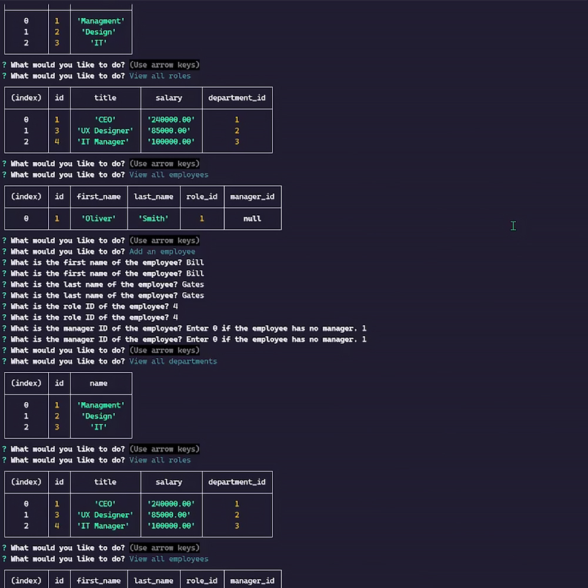

# Module 12 SQL Challenge: Employee Tracker

## Description

This is a command-line application that provides an interactive interface for managing a company's employee database. The motivation behind this project was to create a tool that makes it easy for non-technical users to view and interact with information stored in a database. The application solves the problem of navigating through complex database structures, making it simple and intuitive to manage a company's departments, roles, and employees. During the development of this project, we learned how to build command-line applications using Node.js, interact with a MySQL database, and implement user interfaces with Inquirer.js.

## Table of Contents

- [User Story](#user-story)
- [Acceptance Criteria](#acceptance-criteria)
- [Technologies Used](#technologies-used)
- [Installation](#installation)
- [Usage](#usage)
- [Features](#features)
- [Mock Up](#mock-up)
- [Deployed Application](#deployed-application)
- [Credits](#credits)
- [License](#license)
- [Badges](#badges)

## User Story

- AS A business owner
- I WANT to be able to view and manage the departments, roles, and employees in my company
- SO THAT I can organize and plan my business
- To be added by the user.

## Acceptance Criteria

- GIVEN a command-line application that accepts user input
- WHEN I start the application
- THEN I am presented with the following options: view all departments, view all roles, view all employees, add a department, add a role, add an employee, and update an employee role
- WHEN I choose to view all departments
- THEN I am presented with a formatted table showing department names and department ids
- WHEN I choose to view all roles
- THEN I am presented with the job title, role id, the department that role belongs to, and the salary for that role
- WHEN I choose to view all employees
- THEN I am presented with a formatted table showing employee data, including employee ids, first names, last names, job titles, departments, salaries, and managers that the employees report to
- WHEN I choose to add a department
- THEN I am prompted to enter the name of the department and that department is added to the database
- WHEN I choose to add a role
- THEN I am prompted to enter the name, salary, and department for the role and that role is added to the database
- WHEN I choose to add an employee
- THEN I am prompted to enter the employee’s first name, last name, role, and manager, and that employee is added to the database
- WHEN I choose to update an employee role
- THEN I am prompted to select an employee to update and their new role and this information is updated in the database

## Technologies Used

- [Node.js](https://nodejs.org/)
- [MySQL](https://www.mysql.com/)
- [Inquirer.js](https://github.com/SBoudrias/Inquirer.js/)
- [dotenv](https://github.com/motdotla/dotenv)
- [chalk](https://www.npmjs.com/package/chalk)

## Installation

1. Install [Node.js](https://nodejs.org/) and [MySQL](https://www.mysql.com/) on your machine.
2. Clone this repository to your machine.
3. Navigate to the project directory in your terminal and run `npm install` to install the necessary packages.
4. Create a `.env` file in the root directory with your MySQL username and password:

```
DB_USER=your_mysql_username
DB_PASSWORD=your_mysql_password
```

5. Run `node server.js` to start the application.

## Usage

Once the application is running, you will be presented with a list of options:

- View all departments
- View all roles
- View all employees
- Add a department
- Add a role
- Add an employee
- Update an employee role
- Exit

Use the arrow keys to navigate and press Enter to select an option.

## Features

- View all departments, roles, or employees
- Add a new department, role, or employee
- Update an existing employee's role

## Mock Up



<!-- ## Deployed Application -->

## Credits

- https://coding-boot-camp.github.io/full-stack/github/professional-readme-guide
- https://www.npmjs.com/package/uuid
- https://www.w3schools.com/sql/
- https://www.w3schools.com/js/
- https://dev.mysql.com/doc/
- https://courses.bootcampspot.com/ (Challenge description)

This application uses several open-source packages:

- [mysql2](https://www.npmjs.com/package/mysql2): MySQL client for Node.js with focus on performance.
- [inquirer](https://www.npmjs.com/package/inquirer): A collection of common interactive command-line user interfaces.
- [dotenv](https://www.npmjs.com/package/dotenv): Zero-dependency module that loads environment variables from a `.env` file into `process.env`.
- [chalk](https://www.npmjs.com/package/chalk): Terminal string styling done right.

## License

MIT License

Copyright (c) 2023 xkolsha

Permission is hereby granted, free of charge, to any person obtaining a copy
of this software and associated documentation files (the "Software"), to deal
in the Software without restriction, including without limitation the rights
to use, copy, modify, merge, publish, distribute, sublicense, and/or sell
copies of the Software, and to permit persons to whom the Software is
furnished to do so, subject to the following conditions:

The above copyright notice and this permission notice shall be included in all
copies or substantial portions of the Software.

THE SOFTWARE IS PROVIDED "AS IS", WITHOUT WARRANTY OF ANY KIND, EXPRESS OR
IMPLIED, INCLUDING BUT NOT LIMITED TO THE WARRANTIES OF MERCHANTABILITY,
FITNESS FOR A PARTICULAR PURPOSE AND NONINFRINGEMENT. IN NO EVENT SHALL THE
AUTHORS OR COPYRIGHT HOLDERS BE LIABLE FOR ANY CLAIM, DAMAGES OR OTHER
LIABILITY, WHETHER IN AN ACTION OF CONTRACT, TORT OR OTHERWISE, ARISING FROM,
OUT OF OR IN CONNECTION WITH THE SOFTWARE OR THE USE OR OTHER DEALINGS IN THE
SOFTWARE.

## Badges


